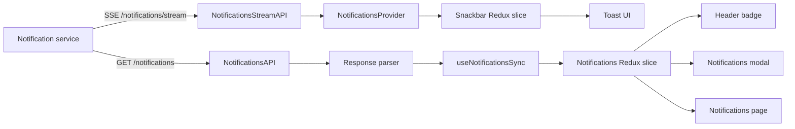
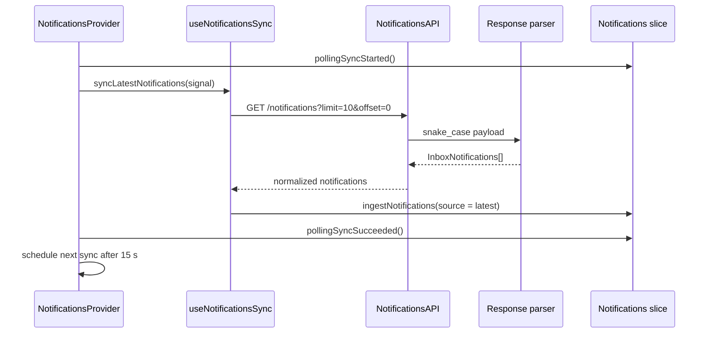
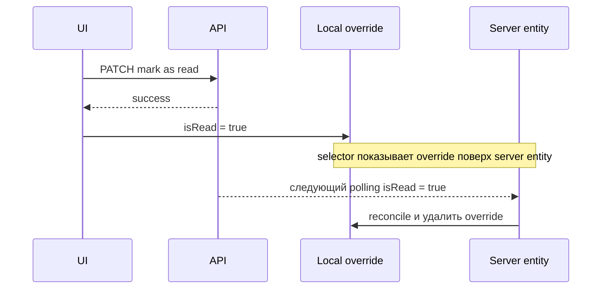
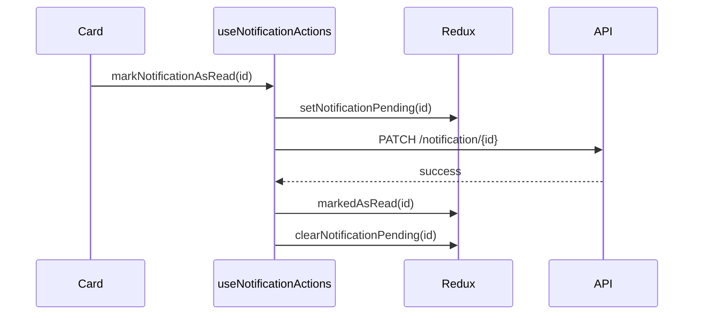

# Архитектура уведомлений

Документ описывает фактическую реализацию уведомлений в текущем frontend-приложении: от подключения к notification service до показа toast, счётчика в header, модального inbox, полной страницы и настроек.

Актуальность: 3 августа 2026 года.

## 1. Краткая модель системы

В приложении существуют два независимых канала доставки уведомлений:

1. **SSE-канал реального времени** немедленно показывает toast.
2. **HTTP inbox-канал** загружает уведомления в Redux, из которого строятся badge, модальное окно и страница `/notifications`.

Это принципиально важно: SSE-событие само по себе не добавляется в Redux inbox. Новое уведомление появляется в badge и списках после ближайшей HTTP-синхронизации.



Разделение даёт системе разные характеристики:

- toast должен появиться максимально быстро;
- inbox должен быть согласован с серверным источником истины;
- временная ошибка SSE не уничтожает inbox;
- потерянное SSE-событие позднее будет получено через HTTP;
- получение toast не зависит от того, открыто ли модальное окно уведомлений.

Цена такого решения — небольшое окно рассогласования: toast уже показан, а badge и inbox могут обновиться до 15 секунд спустя.

## 2. Карта владельцев ответственности

```text
src/App.tsx
└── NotificationsProvider
    ├── useSseToastNotifications
    │   └── NotificationsStreamAPI
    │       └── EventSource
    └── useInboxNotificationsPollingSync
        └── useNotificationsSync
            └── NotificationsAPI.getNotifications
                └── parseNotificationsResponse
                    └── Notifications Redux slice

Notifications Redux slice
├── entity adapter: серверные InboxNotifications
├── latestIds: окно последних уведомлений
├── localOverridesById: локальные read/invite overrides
├── pendingIds: блокировка повторных действий
└── версии и состояние polling

Selectors
├── объединяют server entity + local override
├── скрывают отменённые приглашения
├── делят на read/unread
└── формируют badge, modal и page projections

UI
├── AccountButtons: кнопка и badge
├── NotificationsModal: последние пять уведомлений
├── NotificationsPage: пагинируемый inbox
├── NotificationsBody: обработка действий
├── NotificationCard constructor: domain → presentation model
├── NotificationCard: чистый UI
└── Toast: очередь realtime toast
```

Основные файлы:

- `src/providers/NotificationsProvider.tsx` — глобальный жизненный цикл polling и SSE.
- `src/api/NotificationsAPI.tsx` — HTTP endpoints.
- `src/api/NotificationsStreamAPI.ts` — singleton SSE connection.
- `src/api/helpers/parseNotificationsResponse.ts` — runtime-нормализация HTTP/SSE payload.
- `src/store/slices/Notifications/index.ts` — нормализованный inbox.
- `src/store/slices/Notifications/selectors.ts` — итоговые представления данных.
- `src/hooks/notifications/useNotificationActions.ts` — пользовательские mutations.
- `src/pages/NotificationsPage/hooks/useNotificationsPage.ts` — пагинация полной страницы.
- `src/components/Notifications/**` — modal, карточки и presentation mapping.
- `src/store/slices/Snackbar/index.ts` и `src/components/Toast/Toast.tsx` — realtime toast.
- `src/pages/NotificationsSettings/**` — настройки каналов уведомлений.

## 3. Запуск системы

`NotificationsProvider` подключён практически над всем приложением:

```tsx
<Provider store={store}>
    <AuthBootstrap>
        <HashRouter>
            <NavigationHistoryProvider>
                <NotificationsProvider>
                    <ScrollToTop />
                    <AppContent />
                    <Toast />
                </NotificationsProvider>
            </NavigationHistoryProvider>
        </HashRouter>
    </AuthBootstrap>
</Provider>
```

Почему provider расположен здесь:

- он уже находится внутри Redux Provider и может dispatch-ить actions;
- он находится внутри Router и знает текущий `pathname`;
- он находится после `AuthBootstrap` и получает установленное состояние аутентификации;
- он не зависит от конкретной страницы;
- `Toast` и весь основной UI живут внутри одного notification lifecycle.

После изменения auth state provider принимает два независимых решения:

```tsx
const canUseAuthenticatedNotifications = isAuthenticated;
const shouldPollInboxNotifications =
    canUseAuthenticatedNotifications && isDocumentVisible && !isAuthFlowRoute(pathname);
```

SSE работает для любого аутентифицированного пользователя. HTTP polling дополнительно требует:

- видимый документ;
- маршрут вне login/signup/recovery flow.

При logout:

```tsx
useEffect(() => {
    if (!isAuthenticated) {
        dispatch(reset());
    }
}, [dispatch, isAuthenticated]);
```

Одновременно SSE-hook очищает отложенные realtime-события и вызывает `disconnectNotificationsStream()`. Это предотвращает показ данных предыдущего пользователя после смены сессии.

## 4. HTTP transport и аутентификация

Notification service использует отдельный Axios instance:

```ts
export const axiosNotificationsInstance = axios.create({
    baseURL: `${BASE_URL}/${ServiceName.Notification}`,
    headers: { 'Content-Type': 'application/json' },
    withCredentials: true,
});

axiosNotificationsInstance.interceptors.request.use(
    createAuthRequestInterceptor({ addFingerprint: false }),
    (error) => Promise.reject(toError(error)),
);

axiosNotificationsInstance.interceptors.response.use(
    (response) => response,
    createAuthResponseInterceptor(axiosNotificationsInstance),
);
```

Это означает:

- HTTP-запросы идут в `${BASE_URL}/notification`;
- cookies разрешены через `withCredentials`;
- request interceptor добавляет bearer token, если он доступен;
- при поддерживаемой auth-ошибке общий response interceptor выполняет refresh;
- после refresh исходный запрос повторяется;
- окончательная потеря сессии проходит через общий `authSessionBridge`.

Notification API не реализует собственный refresh. Это правильно: политика аутентификации принадлежит общему транспортному слою, а не feature-коду.

### 4.1 HTTP endpoints

```ts
GET   /notifications?limit={limit}&offset={offset}&is_read={boolean}
PATCH /notification/{id}
PATCH /notifications
GET   /settings
PATCH /settings
```

Назначение:

- `GET /notifications` — последние или пагинируемые inbox notifications;
- `PATCH /notification/{id}` — отметить одно уведомление прочитанным;
- `PATCH /notifications` — отметить прочитанными все уведомления;
- `GET /settings` — получить настройки email/push по категориям;
- `PATCH /settings` — изменить один или несколько флагов категории.

Параметр `is_read` добавляется только при явном boolean:

```ts
if (typeof isRead === 'boolean') {
    searchParams.set('is_read', String(isRead));
}
```

Поэтому один endpoint поддерживает:

- смешанное окно последних уведомлений;
- только unread;
- только read.

## 5. HTTP polling inbox

Polling реализован не через `setInterval`, а через последовательный `setTimeout`:

```ts
const GET_INBOX_NOTIFICATIONS_INTERVAL = 15000;

const schedulePollingSync = (timeoutRef, runSync): void => {
    timeoutRef.current = setTimeout((): void => {
        runSync().catch(handleScheduledPollingError);
    }, GET_INBOX_NOTIFICATIONS_INTERVAL);
};
```

### 5.1 Последовательность одного цикла



`useNotificationsSync` всегда загружает окно из десяти последних записей:

```ts
const notifications = await getNotifications({
    limit: LATEST_NOTIFICATIONS_LIMIT,
    signal,
});

dispatch(
    ingestNotifications({
        notifications,
        source: 'latest',
    }),
);
```

### 5.2 Почему используется `setTimeout`, а не `setInterval`

Следующий запрос планируется только после завершения предыдущего. Если сеть отвечает пять секунд, новый запрос начнётся приблизительно через двадцать секунд от старта предыдущего, а не параллельно с ним.

Дополнительно есть защита:

```ts
if (isSyncingRef.current || abortController.signal.aborted) {
    return;
}
```

Она не позволяет запустить два sync одновременно даже при неожиданном повторном вызове.

### 5.3 Остановка и возобновление

Polling останавливается, если:

- пользователь вышел;
- вкладка стала скрытой;
- приложение перешло на auth route;
- provider размонтирован.

Cleanup:

```ts
return (): void => {
    abortController.abort();
    clearPollingTimeout(timeoutRef);
};
```

При возвращении видимости `shouldPoll` снова становится `true`, effect запускается заново и выполняет sync немедленно. Пользователь не ждёт первые 15 секунд после возвращения.

### 5.4 Ошибки polling

Abort и Axios cancellation считаются штатным завершением:

```ts
const isSyncAbortError = (error: unknown): boolean =>
    axios.isCancel(error) || (error instanceof DOMException && error.name === 'AbortError');
```

Обычная ошибка:

- выводится в `console.error`;
- записывает `pollingError`;
- устанавливает `isPollingStale = true`;
- не прекращает будущие попытки.

Успешный запрос:

- очищает ошибку;
- записывает `lastSyncAt`;
- снимает stale-флаг.

UI сейчас почти не использует эти диагностические поля, но они позволяют добавить индикатор устаревших данных без изменения transport.

## 6. SSE realtime transport

Realtime transport использует нативный `EventSource`:

```ts
const NOTIFICATIONS_STREAM_PATH = 'notifications/stream';
const subscribers = new Set<NotificationsStreamSubscriber>();
let eventSource: EventSource | null = null;
```

URL строится из `axiosNotificationsInstance.defaults.baseURL`, то есть stream и HTTP API гарантированно направлены в один notification service:

```ts
const normalizedBaseUrl = baseUrl.endsWith('/') ? baseUrl : `${baseUrl}/`;
return new URL(NOTIFICATIONS_STREAM_PATH, normalizedBaseUrl).toString();
```

### 6.1 Один connection на приложение

`NotificationsStreamAPI` — модульный singleton:

- любое число consumers может подписаться;
- физически создаётся один `EventSource`;
- входящее событие рассылается snapshot-копии subscribers;
- ошибка одного callback не ломает остальные callbacks.

```ts
const forEachSubscriber = (callback): void => {
    const subscribersSnapshot = Array.from(subscribers);

    subscribersSnapshot.forEach((subscriber) => {
        try {
            callback(subscriber);
        } catch (error) {
            reportSubscriberCallbackError(error);
        }
    });
};
```

Snapshot нужен, чтобы subscriber мог отписаться во время callback, не нарушая текущий обход `Set`.

### 6.2 Зачем существует grace period 150 ms

После удаления последнего subscriber connection закрывается не мгновенно:

```ts
const STREAM_CLOSE_GRACE_PERIOD = 150;
```

Закрытие откладывается. Если за это время появляется новый subscriber, timeout отменяется и существующий stream переиспользуется.

Это снижает churn при быстрых mount/unmount циклах, включая development Strict Mode и кратковременное перестроение provider tree.

### 6.3 Auth SSE

Для cross-origin URL создаётся:

```ts
new EventSource(streamUrl, { withCredentials: true });
```

У `EventSource` нет стандартного механизма произвольных Authorization headers. Поэтому SSE authentication должна поддерживаться cookies/credentials на стороне backend. Axios request interceptor к SSE не применяется.

Для same-origin URL дополнительная опция не передаётся, поскольку same-origin cookies обслуживаются браузером штатно.

### 6.4 Типы событий

Client слушает:

```ts
eventSource.onmessage = handleMessage;
eventSource.addEventListener('notification', handleCustomNotificationEvent);
```

Это поддерживает оба server-варианта:

- обычный SSE message без `event:`;
- именованное событие `event: notification`.

### 6.5 Reconnect

Ручной reconnect отсутствует. Нативный `EventSource` автоматически пытается переподключиться после transport error, пока объект не закрыт.

Ошибка описывается структурой:

```ts
interface NotificationsStreamError {
    kind: 'transport' | 'parse';
    readyState: number | null;
    hasActiveConnection: boolean;
    isReconnectable: boolean;
    cause?: unknown;
}
```

Provider сейчас только логирует её. Пользовательский UI о состоянии SSE не уведомляется.

## 7. Realtime toast pipeline

Provider подписывается на SSE при аутентификации:

```ts
const unsubscribe = subscribeToNotificationsStream({
    onNotification: (notification) => {
        const canShowRealtimeToast = document.visibilityState === 'visible' && document.hasFocus();

        if (canShowRealtimeToast) {
            showRealtimeToast(notification, showNotification);
            return;
        }

        hiddenRealtimeNotificationsRef.current.push(notification);
    },
});
```

### 7.1 Поведение активного окна

Если документ видим и окно имеет focus:

1. SSE payload парсится.
2. Из notification берутся title, text, status и максимум две action.
3. `showNotification` создаёт запись в Snackbar Redux slice.
4. `Toast` отображает её через design-system `NotificationAlert`.

### 7.2 Поведение фоновой вкладки

Если окно скрыто или потеряло focus, событие не пропадает. Оно сохраняется:

```ts
const hiddenRealtimeNotificationsRef = useRef<StreamNotifications[]>([]);
```

После возвращения focus provider копирует очередь, очищает ref и показывает каждый накопленный toast.

Это решение предотвращает исчезновение transient UI-событий, но имеет следствие: после долгого отсутствия пользователь может получить серию старых toast. Ограничение размера и дедупликация этой очереди сейчас отсутствуют.

### 7.3 Temp и const toast

SSE payload содержит `snackType`:

- `temp` — автоматически скрывается;
- `const` — остаётся до явного закрытия или выполнения action.

Неизвестное значение нормализуется в `const`, то есть выбирается безопасное поведение «не потерять важное сообщение».

### 7.4 Toast actions

В toast переносится максимум две server action:

```ts
const MAX_TOAST_ACTIONS = 2;
const actions = notification.content.actions?.slice(0, MAX_TOAST_ACTIONS) ?? [];
```

Поддерживаются:

- absolute URL через `window.open(..., 'noopener,noreferrer')`;
- relative URL через React Router;
- feedback route с открытием feedback form;
- agents assignment route с открытием `AssignSpaceModal`;
- до двух ссылок в design-system alert.

Для assignment action provider переносит `movedAgents` из `context.extraData` в `SnackbarAction`. Благодаря этому toast может открыть модальное окно с конкретным набором агентов без повторного запроса.

### 7.5 Очередь toast

Snackbar slice хранит все toast:

```ts
interface snackbarsState {
    snackbars: SnackbarItem[];
}
```

`Toast` показывает одновременно максимум три:

```ts
const MAX_VISIBLE_TOASTS = 3;
const visibleNotifications = notifications.slice(0, MAX_VISIBLE_TOASTS);
```

Остальные остаются в Redux queue. Auto-hide timer начинается только после попадания toast в видимую тройку и завершения enter transition. Это важно: скрытый в очереди toast не истекает до фактического показа.

## 8. Runtime-парсинг и защита от некорректного backend payload

TypeScript types не защищают приложение от JSON, пришедшего по сети. Поэтому HTTP и SSE проходят через runtime parser.

### 8.1 Общая последовательность

```text
raw backend response
→ deserializeSnakeToCamelCase
→ field-level normalization
→ InboxNotifications
→ optional StreamNotifications.snackType
```

Минимально обязательны:

- числовой `id` либо строка, преобразуемая в число;
- объект `content`;
- строковые `content.title` и `content.text`;
- `createdAt` для HTTP inbox.

Для stream отсутствие `createdAt` компенсируется текущим временем:

```ts
const createdAt =
    typeof value.createdAt === 'string'
        ? value.createdAt
        : mode === 'stream'
          ? new Date().toISOString()
          : null;
```

Почему stream допускает fallback: realtime toast может быть полезен даже при неполном timestamp. Inbox строже, потому что timestamp участвует в сортировке и пагинационном представлении.

### 8.2 Нормализация enum-like полей

- неизвестный `uiType` → `info`;
- неизвестный notification `status` → `info`;
- неизвестный context type → исходная непустая строка либо `unknown`;
- неизвестный `snackType` → `const`;
- неизвестный `urlType` определяется по виду URL;
- неизвестные actions отбрасываются;
- некорректные элементы `movedAgents` отбрасываются по одному.

Такой parser следует стратегии tolerant reader: сохранить полезную часть notification, не уронив весь feed из-за одного расширенного поля.

### 8.3 Ошибка одного элемента не ломает массив

```ts
return value.reduce<InboxNotifications[]>((notifications, notification) => {
    try {
        return [...notifications, parseInboxNotification(notification, 'inbox')];
    } catch (error) {
        logSkippedNotificationOnce(notification, error, 'notification response item');
        return notifications;
    }
}, []);
```

Если массив валиден, но одна запись повреждена, остальные попадут в UI.

### 8.4 Защита console от повторного шума

Parser хранит signatures уже залогированных невалидных уведомлений. Одна и та же проблема логируется один раз, а не каждые 15 секунд polling.

## 9. Модель данных

Базовый domain type:

```ts
interface InboxNotifications {
    id: number;
    uiType: 'accept_decline' | 'button' | 'underline_button' | 'info';
    status: 'error' | 'info';
    content: NotificationContent;
    sender: NotificationSender | null;
    context: NotificationContext;
    createdAt: string;
    updatedAt: string | null;
    isRead: boolean;
}

interface StreamNotifications extends InboxNotifications {
    snackType: 'temp' | 'const';
}
```

`content` описывает пользовательский текст и server-driven actions. `sender` описывает инициатора события. `context` описывает сущность, к которой относится notification: space, agent, user и другие типы.

`context.extraData` сейчас имеет два основных варианта:

- invitation ID/status для `accept_decline`;
- список перемещённых агентов для `space_deleted`/assignment flow.

## 10. Redux inbox state

Состояние нормализовано через `createEntityAdapter`:

```ts
export const notificationsAdapter = createEntityAdapter<InboxNotifications>({
    sortComparer: (left, right) => right.createdAt.localeCompare(left.createdAt),
});
```

Вместо массива Redux хранит:

```text
ids: number[]
entities: Record<number, InboxNotifications>
```

Преимущества:

- одна notification хранится один раз;
- modal и page могут ссылаться на те же entity;
- page ingestion не создаёт второй кеш;
- upsert по `id` прост;
- сортировка newest-first централизована.

Расширенные поля:

```ts
interface NotificationState {
    latestIds: number[];
    latestFeedVersion: number;
    pendingIds: number[];
    localOverridesById: Record<number, NotificationLocalOverride>;
    pollingError: string | null;
    lastSyncAt: string | null;
    isPollingStale: boolean;
    readStateVersion: number;
}
```

### 10.1 `latestIds`

Это IDs последнего HTTP-окна размером десять. Оно является источником для:

- header unread badge;
- modal;
- определения последних unread/read.

Page pagination добавляет entities, но не меняет `latestIds`. Поэтому старое уведомление, загруженное на странице, не попадёт внезапно в header modal.

### 10.2 `latestFeedVersion`

Версия увеличивается, если:

- поменялся список `latestIds`;
- изменилось сравниваемое содержимое одной из последних notifications.

Полная страница наблюдает эту версию и refresh-ит уже инициализированные tabs.

### 10.3 `readStateVersion`

Версия увеличивается после локального:

- `markedAsRead`;
- `markedAllAsRead`;
- изменения invitation status.

Она сообщает pagination hook, что состав unread/read страниц мог измениться и offsets следует пересчитать с начала.

### 10.4 `pendingIds`

Содержит notifications, для которых выполняется mutation. UI использует его для:

- запрета повторного mark-as-read;
- запрета двойного accept/decline;
- disabled-состояния карточки/action.

### 10.5 `localOverridesById`

Backend может вернуть устаревшее состояние сразу после успешного PATCH. Если просто заменить entity серверным ответом, UI визуально откатится:

```text
user marks notification as read
→ PATCH succeeds
→ UI shows read
→ polling receives old isRead=false
→ UI wrongly shows unread again
```

Поэтому mutation не изменяет server entity. Она добавляет локальный override:

```ts
markedAsRead: (state, action) => {
    mergeLocalOverride(state, action.payload, { isRead: true });
    state.readStateVersion += 1;
};
```

Selectors накладывают override поверх entity. Когда polling наконец возвращает совпадающее серверное значение, `reconcileNotificationOverride` удаляет уже ненужный override.



Такая схема сохраняет различие между серверными данными и временной локальной коррекцией.

## 11. Ingestion

Оба HTTP-потока dispatch-ят один action:

```ts
ingestNotifications({
    notifications,
    source: 'latest' | 'page',
});
```

### 11.1 `source: latest`

- upsert изменившихся entities;
- reconcile overrides;
- полностью заменить `latestIds` актуальным окном;
- при фактическом изменении увеличить `latestFeedVersion`.

### 11.2 `source: page`

- upsert entities;
- reconcile overrides;
- не трогать `latestIds`;
- не увеличивать latest feed version.

Это позволяет разделить общий entity cache и разные окна навигации.

### 11.3 Защита от лишних обновлений

Перед `upsertMany` notification сравнивается с entity:

```ts
const changedNotifications = incoming.filter(
    (notification) => !areNotificationsEqual(state.entities[notification.id], notification),
);
```

Цель — не менять object identity и не запускать selectors/rerenders, если polling вернул те же данные.

Сравнение намеренно использует компактную comparable shape, а не весь объект. Текущие поля сравнения перечислены в разделе «Ограничения».

## 12. Selectors: где формируется видимое состояние

Reducers хранят server entities и overrides раздельно. Их объединение выполняется selectors:

```ts
const mergedNotification = mergeNotificationOverride(notification, localOverrides[notification.id]);
```

Затем скрываются отменённые invitation notifications:

```ts
return !isCancelledInviteNotification(notification);
```

Только после этого данные делятся на read/unread.

Это означает, что components получают уже готовую domain projection и не обязаны знать о:

- server lag;
- local overrides;
- cancelled invitation filtering;
- entity adapter.

### 12.1 Основные projections

```text
selectLatestNotificationsWindow
  latestIds → merged visible notifications

selectLatestUnreadNotifications
  latest window → unread

selectModalNotifications
  latest unread-first → первые 5

selectUnreadCount
  количество unread в latest window

selectAllLoadedNotificationsNewestFirst
  все загруженные entities → merged visible

selectNotificationsByIdsForView
  page visibleIds → all или unread
```

### 12.2 Важная семантика badge

`selectUnreadCount` считает unread только внутри последних десяти уведомлений, а не глобальное количество unread на сервере.

Поэтому badge показывает размер unread-части текущего latest window. Если сервер хранит больше десяти непрочитанных уведомлений, badge всё равно не превысит десять.

## 13. Header и modal

`AccountButtons`:

- отключает notification button для guest;
- берёт `unreadCount` из Redux;
- показывает числовой design-system `Badge`;
- открывает `NotificationsModal`;
- взаимно закрывает user menu и notifications modal.

Modal берёт:

```ts
const latestNotifications = useAppSelector(selectLatestNotificationsWindow);
const modalNotifications = useAppSelector(selectModalNotifications);
const hasUnreadLatestNotifications = useAppSelector(selectHasUnreadNotifications);
```

Правила modal:

- показывает максимум пять элементов;
- unread располагаются раньше read;
- если latest window содержит unread, modal работает в `unread` empty-state mode;
- `Mark all as read` не вызывается, если среди видимых пяти нет unread;
- modal рендерится через portal в `document.body`;
- outside click закрывает modal;
- переход из notification закрывает modal.

## 14. Полная страница `/notifications`

Страница защищена `PrivateRoute` и использует отдельный pagination hook.

У неё две вкладки:

- `all`;
- `unread`.

Для каждой вкладки локально хранятся:

```ts
interface TabState {
    visibleIds: number[];
    hasMore: boolean;
    cursor: PaginationCursor;
    isInitialized: boolean;
}
```

Redux хранит entities, но состояние просмотра — активная вкладка, cursor и visible IDs — остаётся локальным для страницы. Это корректная граница:

- entity — server state, полезный разным surfaces;
- cursor/selected tab — UI navigation state конкретной страницы.

### 14.1 Почему `all` использует два offset

Требуемый порядок — сначала все unread, затем read. Backend фильтрует `is_read`, поэтому одного offset недостаточно:

```ts
interface PaginationCursor {
    unreadOffset: number;
    readOffset: number;
    unreadExhausted: boolean;
}
```

Алгоритм одного chunk:

1. Запросить unread до заполнения `pageSize`.
2. Если unread вернул меньше запрошенного, считать его исчерпанным.
3. Оставшееся место заполнить read.
4. Обновить оба offset независимо.

Пример при `pageSize = 10`:

```text
GET unread limit=10 offset=0 → 6 элементов
GET read   limit=4  offset=0 → 4 элемента

cursor:
  unreadOffset = 6
  readOffset = 4
  unreadExhausted = true
```

Следующий chunk пойдёт только в read feed.

### 14.2 Уникальность IDs

`appendUniqueIds` не позволяет одному ID повториться при refresh или изменении server pagination.

### 14.3 Реакция на изменения

Hook наблюдает:

- `latestFeedVersion`;
- `readStateVersion`.

При изменении refresh выполняется для всех уже открывавшихся tabs. Он загружает с начала столько элементов, сколько сейчас отображается, чтобы сохранить глубину страницы и одновременно пересчитать unread/read boundaries.

Если refresh пришёл во время fetch, выставляется `pendingRefreshAllRef`. После завершения активного запроса refresh запускается ещё раз. Это предотвращает параллельную гонку и не теряет сигнал обновления.

## 15. Presentation mapping карточки

Backend notification не передаётся непосредственно в `NotificationCard`. Сначала constructor строит `NotificationCardModel`.

```text
InboxNotifications
→ constructNotificationCard
→ NotificationCardModel
→ NotificationCard
```

Constructor отвечает за решения:

- fallback avatar;
- ссылка sender title на profile;
- ссылка context media на space/agent;
- square/circle shape;
- image или gradient;
- максимум две actions;
- interpretation `Accept`/`Decline`;
- danger/primary/secondary/link variants;
- текст resolved invitation status.

Так transport/domain schema не смешивается с JSX и design-system props.

### 15.1 Server-driven UI types

`uiType` определяет представление:

- `accept_decline` — распознать invitation actions;
- `button` — обычные кнопки;
- `underline_button` — link-like actions;
- `info` — без действий.

Для invitation action kind определяется по тексту `Accept`/`Decline`. Invitation ID сначала извлекается из URL, затем action layer может использовать `context.extraData.inviteId` как fallback.

После resolved status (`accepted`, `declined`, `space_not_found`) кнопки скрываются, вместо них показывается статус.

## 16. Пользовательские действия

Все stateful actions собраны в `useNotificationActions`.

### 16.1 Mark one as read



Обновление не является optimistic до ответа API: visual read override устанавливается только после успешного PATCH. `pendingIds` при этом блокирует повторный click.

`finally` гарантирует снятие pending даже при ошибке.

### 16.2 Mark all as read

```text
PATCH /notifications
→ markedAllAsRead()
→ override isRead=true для всех загруженных entities
→ readStateVersion++
```

Важно: локально обновляются только уже загруженные entities. Серверный PATCH отвечает за остальные записи. Следующие HTTP-запросы принесут их уже прочитанными.

### 16.3 Accept/decline invitation

Последовательность:

1. Найти invitation ID.
2. Поставить notification в pending.
3. Выполнить `updateInvitation(inviteId, action)`.
4. Установить local invite status и `isRead=true`.
5. Обновить связанные данные пользователя.
6. Снять pending.

После accept параллельно обновляются:

- collaborations;
- own spaces;
- receiver pending invites.

После decline обновляется список receiver pending invites.

Специальная server error `space.invitation_already_responded` преобразуется в локальный status `space_not_found`, а не пробрасывается в UI как общая ошибка. Это отражает бизнес-смысл: invitation больше нельзя обработать, поэтому actions нужно скрыть.

### 16.4 Навигационные действия

`NotificationsBody` сначала отмечает notification прочитанным, затем:

- открывает absolute URL в новой вкладке;
- делает internal navigation;
- открывает assignment modal для специального route;
- закрывает родительский modal через `onNavigate`.

Текущий порядок означает: если mark-as-read API завершится ошибкой, последующая навигация также не выполнится, поскольку она ожидает успешного `await`.

## 17. Notification settings

Настройки реализованы отдельным потоком и не хранятся в Notifications Redux slice.

При mount:

```text
GET /settings
→ NotificationSettingsService.rawListToCategories
→ объединение server flags с локальными title/description metadata
→ local React state
```

При toggle используется optimistic UI:

```text
сохранить previousCategories
→ сразу изменить local state
→ PATCH /settings
→ при ошибке вернуть previousCategories и показать snackbar
```

Redux здесь не нужен, потому что settings используются одной страницей и не разделяются между несколькими surfaces.

Локальный metadata catalog сейчас содержит только категорию `account`. Ответы backend с неизвестными IDs получают пустые title/description и затем отфильтровываются страницей.

## 18. Полные end-to-end сценарии

### 18.1 Пришло новое realtime уведомление

```text
Backend SSE
→ EventSource
→ parseStreamNotificationResponse
→ subscriber callback
→ active window?
   ├── yes: showRealtimeToast
   └── no: hiddenRealtimeNotificationsRef
→ addSnackbar
→ Toast queue
→ NotificationAlert

Отдельно:
следующий HTTP polling
→ ingest latest
→ latestIds/latestFeedVersion
→ badge/modal/page refresh
```

### 18.2 Пользователь открывает header modal

```text
AccountButtons
→ selectUnreadCount
→ show badge
→ open NotificationsModal
→ selectModalNotifications
→ merge local overrides
→ filter cancelled invitations
→ unread first
→ first 5
→ constructNotificationCard
→ render NotificationCard
```

### 18.3 Пользователь открывает полную страницу

```text
PrivateRoute /notifications
→ useNotificationsPage initializes "all"
→ GET unread page
→ optionally GET read remainder
→ ingest source=page
→ store visible IDs locally
→ selector resolves IDs from shared Redux entities
→ NotificationsBody renders cards
```

### 18.4 Пользователь принимает приглашение

```text
Action button
→ mark notification as read if needed
→ resolve invite ID
→ pending
→ Collaboration API accept
→ local override: accepted + read
→ refresh collaborations/spaces/invites
→ pending cleared
→ selector merges override
→ card buttons disappear
→ "Accepted" appears
→ later polling confirms server status
→ override removed
```

## 19. Почему архитектура устроена именно так

### Отдельный SSE и HTTP inbox

SSE оптимален для низкой задержки, но не является надёжным долговременным хранилищем. HTTP polling восстанавливает фактическое серверное состояние после disconnect, reload или пропущенного события.

### Singleton EventSource

Несколько физических connections от modal, page и header дублировали бы события и нагрузку. Subscriber abstraction оставляет один connection и допускает будущих consumers.

### Entity adapter

Modal и page используют пересекающиеся записи. Нормализация предотвращает независимые копии одной notification.

### `latestIds` отдельно от всех entities

Entity cache отвечает на вопрос «что уже загружено», а `latestIds` — «что вошло в последний актуальный feed». Без этого page pagination могла бы загрязнять modal старыми записями.

### Local overrides

Они защищают UI от eventual consistency backend после mutation и при этом не переписывают server entity вручную.

### Version counters

Pagination хранится локально и не может подписаться только на entity object identity. Явные версии передают семантический сигнал: изменился latest feed либо read grouping.

### Presentation constructor

Server schema и JSX меняются по разным причинам. Constructor локализует интерпретацию server-driven UI и сохраняет `NotificationCard` презентационным.

### Последовательный polling

Новый запрос не стартует до завершения предыдущего, поэтому медленная сеть не создаёт очередь перекрывающихся requests.

## 20. Текущие ограничения и риски

Это не предложения автоматически всё переписать, а фактические свойства текущей реализации.

### 20.1 SSE не обновляет inbox напрямую

Badge/modal/page могут отставать от toast до следующего polling. Интервал — 15 секунд плюс длительность запроса.

### 20.2 Badge не является глобальным unread total

Он считает unread только среди `LATEST_NOTIFICATIONS_LIMIT = 10`.

### 20.3 Hidden toast buffer не ограничен

При долгой фоновой работе очередь может вырасти, а после focus пользователь увидит много старых toast.

### 20.4 Parse errors SSE не доходят до subscriber error callback

`NotificationsStreamError.kind` допускает `parse`, но текущий parser самостоятельно логирует и возвращает `null`. `onError` получает только transport failures.

### 20.5 Comparable shape неполная

`areNotificationsEqual` сравнивает:

- `id`;
- `isRead`;
- content text/actions;
- sender name/username/image;
- context status/invite ID/invite status/image/name.

Она не сравнивает некоторые поля, включая:

- `uiType`;
- `content.title`;
- top-level `status`;
- `createdAt`/`updatedAt`;
- sender DID;
- context type/ID;
- `movedAgents`.

Если backend изменит только одно из несравниваемых полей при том же ID, entity не будет upsert-нута до изменения какого-либо сравниваемого поля.

### 20.6 Ошибка mark-as-read блокирует навигацию

Переход по карточке/action выполняется после успешного PATCH. При временной ошибке notification service пользователь не перейдёт по ссылке.

### 20.7 Нет пользовательского индикатора stale inbox

Redux хранит `pollingError` и `isPollingStale`, но текущие surfaces не показывают их.

### 20.8 Settings metadata ограничена

UI metadata содержит только `account`; остальные server categories скрываются фильтром пустого title.

### 20.9 Отсутствуют notification-specific tests

При текущем поиске в `src` не найдены test/spec файлы для provider, stream, reducers, selectors, pagination и actions. Наиболее рискованные сценарии — reconciliation overrides, dual-offset pagination, SSE lifecycle и invitation side effects.

## 21. Как безопасно расширять систему

### Добавление нового обычного notification

1. Убедиться, что backend присылает обязательные `id`, `content`, `created_at`.
2. Использовать существующий `ui_type`, если возможно.
3. Для новой action задать корректные `text`, `url`, `url_type`.
4. Проверить parser normalization.
5. При необходимости расширить presentation constructor.
6. Не добавлять transport-условия в `NotificationCard`.

### Добавление нового `uiType`

Потребуются согласованные изменения:

1. `NotificationUiType`;
2. parser normalization;
3. `constructNotificationCard`;
4. UI отображение;
5. action semantics;
6. empty/resolved states;
7. tests parser + constructor + interaction.

### Добавление нового `context.extraData`

1. Расширить union `NotificationExtraData`.
2. Добавить runtime normalization.
3. Использовать discriminant, который можно надёжно определить.
4. Не передавать raw `Record<string, unknown>` глубоко в UI.
5. Добавить selector/constructor helper для интерпретации.

### Изменение polling

Нужно сохранить:

- отсутствие overlapping requests;
- abort при cleanup;
- immediate sync после resume;
- retry после обычной ошибки;
- разделение latest и page ingestion.

### Изменение SSE

Нужно сохранить:

- один physical connection;
- subscriber isolation;
- auth/logout cleanup;
- browser reconnect semantics либо явную замену;
- parsing до dispatch;
- защиту от duplicate subscriptions при быстрых remount.

## 22. Рекомендуемый порядок чтения кода

Чтобы восстановить архитектуру без чтения всего feature:

1. `src/App.tsx`
2. `src/providers/NotificationsProvider.tsx`
3. `src/api/NotificationsStreamAPI.ts`
4. `src/api/NotificationsAPI.tsx`
5. `src/api/helpers/parseNotificationsResponse.ts`
6. `src/store/slices/Notifications/types.ts`
7. `src/store/slices/Notifications/index.ts`
8. `src/store/slices/Notifications/selectors.ts`
9. `src/hooks/notifications/useNotificationActions.ts`
10. `src/components/Notifications/constructors/notificationCardConstructor.ts`
11. `src/components/Notifications/Modal/NotificationsBody/index.tsx`
12. `src/pages/NotificationsPage/hooks/useNotificationsPage.ts`
13. `src/store/slices/Snackbar/index.ts`
14. `src/components/Toast/Toast.tsx`
15. `src/pages/NotificationsSettings/index.tsx`

## 23. Итоговая граница ответственности

```text
Backend notification service
    отвечает за события, inbox, read state и settings

Axios/EventSource
    отвечают за доставку и connection semantics

Runtime parsers
    отвечают за доверенную frontend domain model

NotificationsProvider
    отвечает за глобальный жизненный цикл sync/realtime

Notifications Redux slice
    отвечает за нормализованный inbox и локальное согласование

Selectors
    отвечают за итоговое видимое состояние

Notification actions
    отвечают за mutations и связанные бизнес-side-effects

Constructor
    отвечает за перевод domain notification в presentation model

Components
    отвечают за отображение и пользовательские события
```

Главная идея текущей архитектуры: **realtime-событие используется как немедленный пользовательский сигнал, а HTTP inbox остаётся восстанавливаемым серверным источником истории**. Redux не является копией SSE stream; он является нормализованным кешем HTTP inbox с локальными overrides для согласованного UX.
