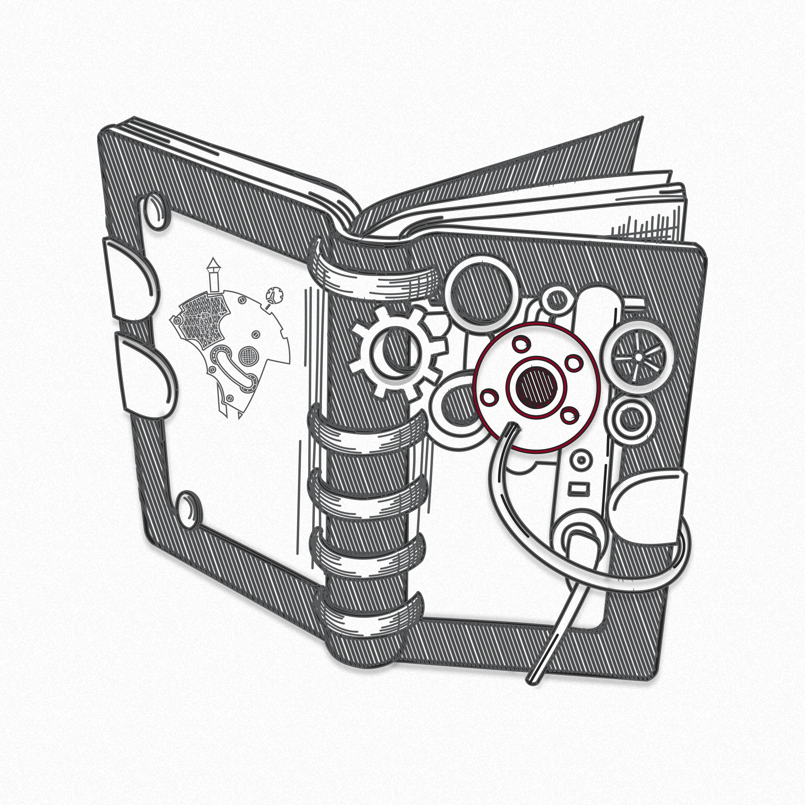

## Подзаголовок

Иногда блоговый пост выигрывает не за счёт объёма, а за счёт ясной композиции. Когда
у текста есть точка входа, спокойный ритм и понятные акценты, читателю проще
удерживать внимание и возвращаться к основному тезису без усилия.

Отдельно работает дистанция между блоками. Если заголовок, лид, изображение и
основной массив текста не спорят друг с другом, страница воспринимается как
цельный материал, а не как набор случайных элементов.

Поэтому даже простой пост лучше собирать как законченную редакторскую полосу: один
заголовок, одна главная картинка, одна узкая колонка чтения и аккуратные действия в
финале.
